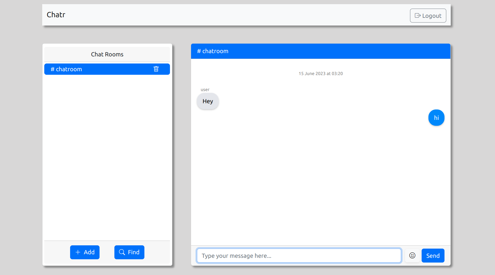

# chatr

real time chat app, with chatrooms

## Technologies used:

- Vue.js for client app
- Nest.js for back end
- Socket.io for maintaining connections (join chatroom, leave chatroom, send message etc.)
- Redis to save messages for quick access
- Postgres to save message history, messages are written to db from redis as batches of length 100
- Docker containers

